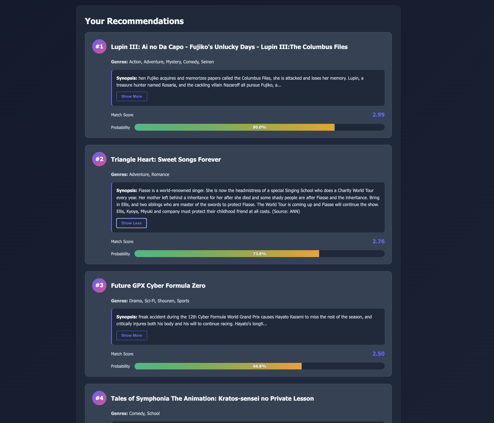

# Anime Recommender System: An end-to-end MLOps application

An end-to-end MLOps project implementing a deep learning-based anime recommendation system with automated CI/CD deployment to Google Kubernetes Engine.

## Overview

This project builds a neural collaborative filtering model to predict anime ratings and provide hybrid personalized recommendations, based on both similar users and similar content. The system is containerized using Docker, versioned with DVC, and automatically deployed to GKE using Jenkins pipelines.

### Key Features

- **Deep Learning Model**: Neural network with embedding layers for users and anime
- **Hybrid recommendation**: Use both similar users to find the best existing anime, between more than 14k animes and 300k users
- **MLOps Pipeline**: Automated training, versioning, and deployment
- **Data Versioning**: DVC integration with Google Cloud Storage
- **CI/CD**: Jenkins pipeline for automated builds and deployments
- **Containerization**: Docker with multi-stage builds
- **Orchestration**: Kubernetes deployment on GKE
- **Experiment Tracking**: Comet ML integration for model monitoring

# User Interface & Usage Guide

## Overview

The Anime Recommender System provides a simple web interface for getting personalized anime recommendations based on your viewing history and preferences.

## How to Use

### 1. Access the Application

**Local Development:**
```
http://localhost:8000
```

**Production Deployment:**
```bash
# Get the external IP from Kubernetes
kubectl get services ml-app-service

# Access via the EXTERNAL-IP shown
http://<EXTERNAL-IP>
```

### 2. Get Recommendations

1. **Enter Your Preferance**
   - Search for your Anime that you have watched before.
   - Rate it from 1 to 10, based on your personal opinion
   - Select between 5 and 40 anime; more anime ratings will lead to a better answer.

2. **Submit Request**
   - Click the "Get Recommendations" button
   - The system processes your request using the trained neural network

3. **View Results**
   - The page displays your personalized anime recommendations
   - Each recommendation includes:
     - Anime title
     - Predicted rating (0-10 scale)
     - Genre information
     - Brief description or metadata

### Screenshots

#### Main Interface


*Clean, minimalist interface for entering user ID and requesting recommendations*

#### Recommendation Results


*Personalized anime recommendations with predicted ratings and details*

## API Usage (Programmatic Access)

For developers or automated systems, use the REST API directly.

### Endpoint

```
POST /predict
```

### Request Format

```bash
curl -X POST http://your-app-url/predict \
  -H "Content-Type: application/json" \
  -d '{"user_id": 123}'
```

### Response Format

```json
{
  "user_id": 123,
  "recommendations": [
    {
      "anime_id": 5114,
      "title": "Fullmetal Alchemist: Brotherhood",
      "predicted_rating": 9.2,
      "genres": ["Action", "Adventure", "Drama"]
    },
    {
      "anime_id": 1535,
      "title": "Death Note",
      "predicted_rating": 8.9,
      "genres": ["Mystery", "Psychological", "Thriller"]
    }
  ],
  "status": "success"
}
```

### Error Response

```json
{
  "error": "User ID not found",
  "status": "error"
}
```

## Features

- **Real-time Predictions**: Instant recommendation generation
- **Personalized Results**: Based on your unique viewing patterns
- **Top-N Recommendations**: Configurable number of suggestions
- **Responsive Design**: Works on desktop and mobile devices
- **RESTful API**: Easy integration with other applications

## User ID Information

- User IDs correspond to users in the training dataset
- Valid range: 1 to the maximum user ID in the system
- If you're a new user not in the training data, the system will use collaborative filtering based on similar users

## Troubleshooting

**"User not found" error:**
- Verify the user ID exists in the dataset
- Check that the model has been trained with this user's data

**Slow response time:**
- First request may be slower due to model loading
- Subsequent requests are cached and faster

**No recommendations returned:**
- The user may have an insufficient rating history
- Try a different user ID with more viewing history

## Privacy & Data

- No personal information is collected through the web interface
- Only user IDs and anime preferences from the public dataset are used
- All data is processed in-memory and not stored persistently


## Architecture

```
├── Data Collection & Processing (Numpy and Pandas)
├── Model Training (TensorFlow/Keras)
├── Model Versioning (DVC)
├── Containerization (Docker)
├── CI/CD Pipeline (Jenkins)
└── Deployment (Google Kubernetes Engine with LoadBalancer)
```

## Tech Stack

**ML/Data**: Python, TensorFlow/Keras, Pandas, NumPy  
**MLOps**: DVC, Comet ML, Jenkins  
**Infrastructure**: Docker, Kubernetes, Google Cloud Platform (GCR, GKE, GCS)  
**Web**: FastAPI, Vanilla HTML+JS+CSS

## Project Structure

```
.
├── artifacts/                          # Generated artifacts (DVC tracked, gitignored)
│   ├── model/                          # Trained model metadata and configurations
│   ├── processed/                      # Transformed datasets ready for training
│   ├── raw/                            # Original datasets from data ingestion
│   └── weights/                        # Model checkpoints and saved weights
│
├── config/
│   ├── config.yaml                     # Central configuration (hyperparameters, training settings, API keys)
│   └── paths_config.py                 # Path constants and directory configurations
│
├── jenkins_project/
│   └── Dockerfile                      # Jenkins container with Docker-in-Docker setup
│
├── logs/                               # Application and training logs (timestamped)
│
├── notebook/                           # Jupyter notebooks for EDA and experimentation
│
├── pipeline/
│   ├── get_anime_list.py              # Fetch and cache anime metadata from sources
│   ├── prediction_pipeline.py         # Inference pipeline for generating recommendations
│   └── training_pipeline.py           # End-to-end model training orchestration
│
├── src/                                # Core source code modules
│   ├── base_model.py                  # Neural network architecture (embedding + deep layers)
│   ├── custom_exception.py            # Custom exception handling with detailed traceback
│   ├── data_ingestion.py              # Download and load raw data from GCS/sources
│   ├── data_processing.py             # Data cleaning, normalization, and transformation
│   ├── logger.py                      # Logging configuration and utilities
│   ├── model_training.py              # Model training, evaluation, checkpoint management
│   └── suggestion_model.py            # Recommendation generation and ranking logic
│
├── static/                             # Frontend assets for web interface
│   ├── index.html                     # Main web page template
│   └── style.css                      # CSS styling for web interface
│
├── utils/                              # Helper functions and utilities
│   ├── common_functions.py            # General utility functions (file I/O, validation)
│   └── suggestion_functions.py        # Recommendation algorithm helpers
│
├── .dvcignore                          # DVC ignore patterns (excludes from versioning)
├── .gitignore                          # Git ignore patterns (artifacts, logs, __pycache__)
├── app.py                              # Flask application entry point (REST API)
├── deployment.yaml                     # Kubernetes deployment and service manifests
├── Dockerfile                          # Production container image definition
├── Jenkinsfile                         # Jenkins CI/CD pipeline definition (build → deploy)
├── requirements.txt                    # Python dependencies and versions
└── setup.py                            # Package installation configuration (pip install -e .)
```

## Model Architecture

The recommender uses a neural collaborative filtering approach:

- **Embedding Layers**: Separate embeddings for users and anime (128 dimensions)
- **Feature Engineering**: Element-wise multiplication and concatenation
- **Deep Network**: 4 dense layers (256→128→64→32) with layer normalization
- **Regularization**: L2 regularization, dropout layers
- **Bias Terms**: User and anime bias embeddings
- **Output**: Sigmoid activation for rating prediction (0-1 normalized)

## Setup & Installation

### Prerequisites

- Python 3.11+
- Docker Desktop
- Google Cloud Platform account
- Jenkins (optional, for CI/CD)

### Local Development

1. **Clone the repository**
```bash
git clone https://github.com/Nikelroid/Anime-Recommender-Application.git
cd Anime-Recommender-Application
```

2. **Create virtual environment**
```bash
python -m venv venv
source venv/bin/activate  # On Windows: venv\Scripts\activate
```

3. **Install dependencies**
```bash
pip install -e .
```

4. **Configure DVC** (if pulling existing models) 
```bash
pip install dvc dvc-gs
dvc remote modify myremote --local credentialpath path/to/gcp-key.json
dvc pull
```

4.5. **Alternative for Data pull** 
```bash
just download data from [kaggle](https://www.kaggle.com/datasets/hernan4444/anime-recommendation-database-2020)
and run data ingestion using this command:
```bash
python src/data_ingestion.py
```


5. **Train the model**
```bash
python pipeline/training_pipeline.py
```

6. **Run the application**
```bash
python app.py
```

Access the application at `http://localhost:8000`

## Data Versioning with DVC

Models and large datasets are tracked using DVC with Google Cloud Storage as remote storage.

**Add new model version:**
```bash
dvc add artifacts/models/saved_model
git add artifacts/models/saved_model.dvc .gitignore
git commit -m "Update model version"
dvc push
```

**Pull latest model:**
```bash
dvc pull
```

## CI/CD Pipeline

### Jenkins Setup

1. **Build Jenkins with Docker-in-Docker**

Create `custom_jenkins/Dockerfile`:
```dockerfile
FROM jenkins/jenkins:lts
USER root
RUN apt-get update -y && \
    apt-get install -y docker-ce docker-ce-cli containerd.io
RUN groupadd -f docker && usermod -aG docker jenkins
USER jenkins
```

Build and run:
```bash
cd custom_jenkins
docker build -t jenkins-dind .
docker run -d --name jenkins-dind \
  --privileged \
  -p 8080:8080 -p 50000:50000 \
  -v /var/run/docker.sock:/var/run/docker.sock \
  -v jenkins_home:/var/jenkins_home \
  jenkins-dind
```

2. **Install Google Cloud SDK & kubectl in Jenkins**
```bash
docker exec -u root -it jenkins-dind bash
apt-get update
apt-get install -y curl apt-transport-https ca-certificates gnupg
curl https://packages.cloud.google.com/apt/doc/apt-key.gpg | apt-key add -
echo "deb https://packages.cloud.google.com/apt cloud-sdk main" | tee -a /etc/apt/sources.list.d/google-cloud-sdk.list
apt-get update && apt-get install -y google-cloud-sdk kubectl google-cloud-sdk-gke-gcloud-auth-plugin
exit
docker restart jenkins-dind
```

3. **Configure Jenkins Credentials**

In Jenkins Dashboard:
- Add GitHub credentials (username + token)
- Add GCP service account key (Secret file: `gcp-key`)

4. **Create Pipeline**

- New Item → Pipeline
- Pipeline script from SCM → Git
- Point to your repository
- Jenkins will use the `Jenkinsfile` in the repo
  

### Pipeline Stages

1. **Clone Repository**: Fetch code from GitHub
2. **Setup Environment**: Create virtual environment and install dependencies
3. **DVC Pull**: Download model weights from GCS
4. **Build Docker Image**: Build for AMD64 platform
5. **Push to GCR**: Upload image to Google Container Registry
6. **Verify Image**: Confirm image exists in GCR
7. **Create Pull Secret**: Setup Kubernetes authentication for GCR
8. **Deploy to GKE**: Apply Kubernetes manifests

## Deployment to GKE

### Prerequisites

1. **Create GKE Cluster**
```bash
gcloud container clusters create ml-app-cluster \
  --zone us-west2-a \
  --num-nodes 2 \
  --machine-type n1-standard-2
```

2. **Get Credentials**
```bash
gcloud container clusters get-credentials ml-app-cluster --zone us-west2-a
```


### Manual Deployment

1. **Build and push Docker image**
```bash
gcloud auth configure-docker
docker build --platform linux/amd64 -t gcr.io/YOUR-PROJECT-ID/ml-project:latest .
docker push gcr.io/YOUR-PROJECT-ID/ml-project:latest
```

2. **Create image pull secret**
```bash
kubectl create secret docker-registry gcr-json-key \
  --docker-server=gcr.io \
  --docker-username=_json_key \
  --docker-password="$(cat path/to/gcp-key.json)" \
  --docker-email=your-email@example.com
```

3. **Deploy application**
```bash
kubectl apply -f deployment.yaml
```

4. **Get external IP**
```bash
kubectl get services ml-app-service
```

Wait for the `EXTERNAL-IP` to be assigned, then access your application.

### Crucial Note

If you want to use Jenkins with Docker in Docker architecture, it is so important to use Jenkinsfile in the root directory and fill in the value `YOUR_VENV_DIR`,
`YOUR_GCP_PROJECT_ID`, `YOUR_GCLOUD_PATH`, and `YOUR_KUBERNETES_AUTH`in Jenkinsfile header in config part, as well as `YOUR_KUBERNETER_CLUSTER_NAME` and
`YOUR_REGION`, which are related to your GKE, and they are located in the Kubernetes deployment stage of the file. Also, fill `YOUR_GCP_PROJECT_ID` value in `deployment.yaml` file, which is related to the Kubernetes configuration

### Kubernetes Configuration

The `deployment.yaml` defines:
- **Deployment**: 1 replica with resource limits
- **Service**: LoadBalancer exposing port 80
- **Image Pull Secret**: For GCR authentication

## Configuration

Edit `config/config.yaml` to modify:
(Don't forget to create a bucket in GCP and fill `YOUR_BUCKET_NAME` with your bucket name.

```yaml
data_ingestion:
  bucket_name: "YOUR_BUCKET_NAME"
  
model_training:
  batch_size: 512
  epochs: 50
  force_training: false  # Skip training if model exists
  checkpoint_dir: "artifacts/models"
  checkpoint_file_name: "saved_model"
```

## Monitoring

The project uses Comet ML for experiment tracking:

- Training/validation loss curves
- Model architecture visualization
- Hyperparameter logging
- Metric tracking per epoch

Set your Comet API key in `src/model_training.py`; you can easily sign up in [Comet-ml](https://www.comet.com/), Then fill `YOURAPI_KEY`,
`YOUR_PROJECT_NAME`, and `YOUR_WORKSPACE` with yours.

## API Endpoints

**GET /** - Home page  
**POST /predict** - Get anime recommendations for a user

Example request:
```json
{
  "user_id": 123
}
```

## Troubleshooting

**Model not loading in Docker:**
- Ensure DVC pull completes before Docker build
- Verify model files exist in `artifacts/models/saved_model`
- Check SavedModel format compatibility (TensorFlow versions)

**ImagePullBackOff in Kubernetes:**
- Verify image exists: `gcloud container images list`
- Check image architecture: `--platform linux/amd64`
- Ensure the image pull secret is created and referenced in deployment

**Training takes too long:**
- Train locally with GPU
- Push trained model to DVC
- Set `force_training: false` in config.yaml

**Not satisfied with recommendations:**
- Change model structure and methods
- Change Hyperparameters, increase epochs, or change loss and activation functions in config.yaml

## Contributing

1. Fork the repository
2. Create a feature branch
3. Make your changes
4. Submit a pull request

## License

This project is licensed under the MIT License.

## Contact

For questions or issues, please open an issue on GitHub.
